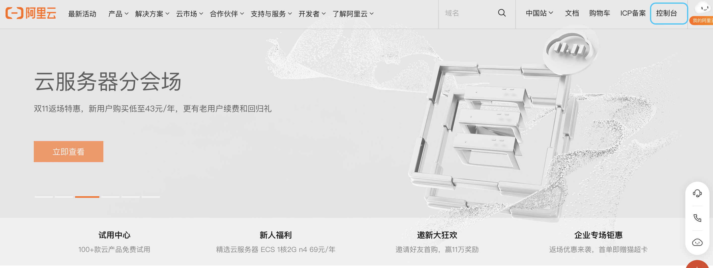
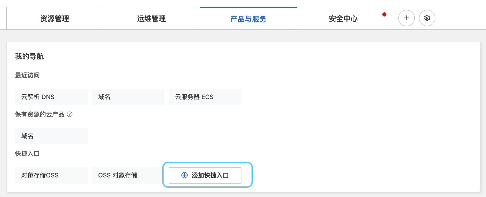
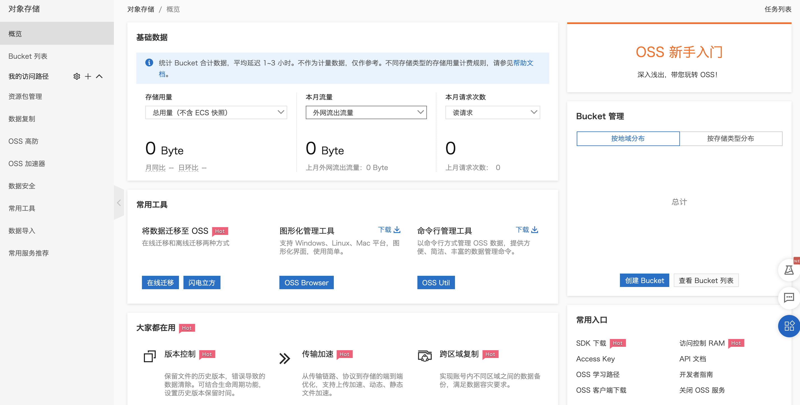
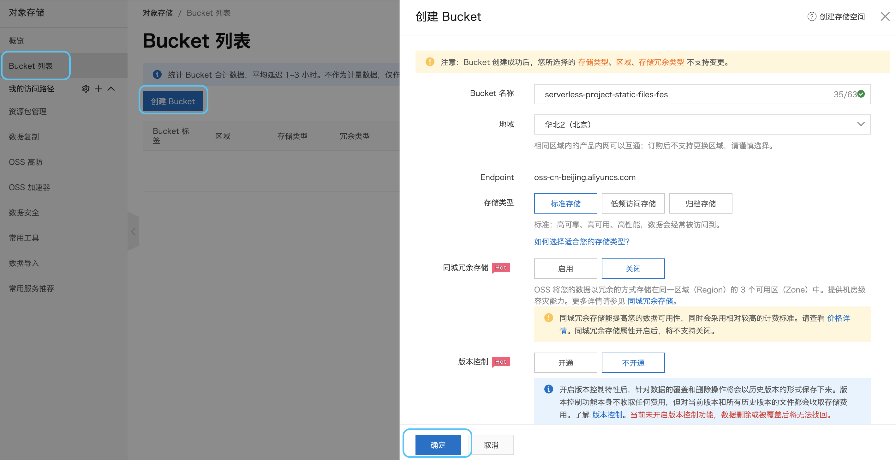
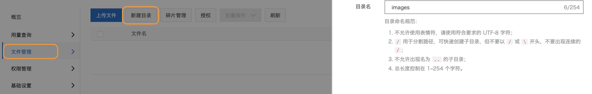
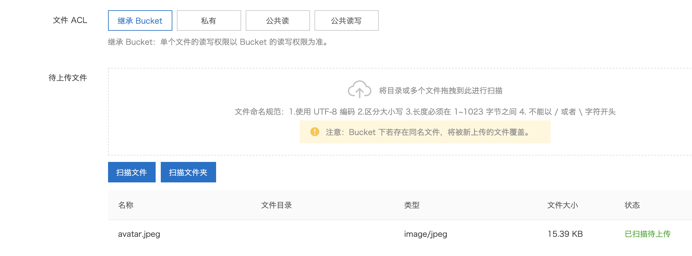
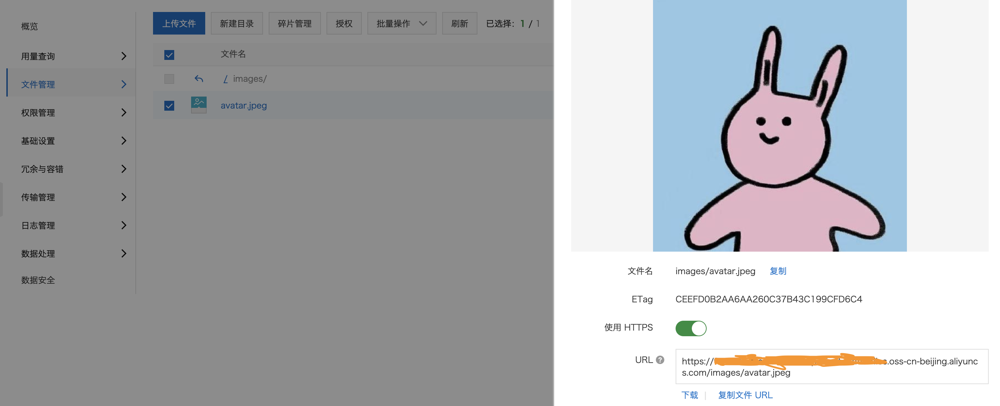

## 使用OSS存储静态资源
- 打开阿里云
- 点击控制台

- 在产品与服务中点击**添加快捷入口**，然后搜索**OSS对象存储**。之后进入**OSS对象存储**，没开通的的可以申请开通一下。

- 进入之后可以看到如下页面

- 点击Bucket列表，根据自己的需求创建Bucket

- 点击文件管理创建一个新的目录用于存储

- 把文件拖拽到虚线框中并上传文件

- 复制图片url就可以使用了

## css省略号
[单/多行超出部分显示省略号](https://zhuanlan.zhihu.com/p/55084931)
### 单行省略号
### 多行省略号

## 中文排版标准化文档